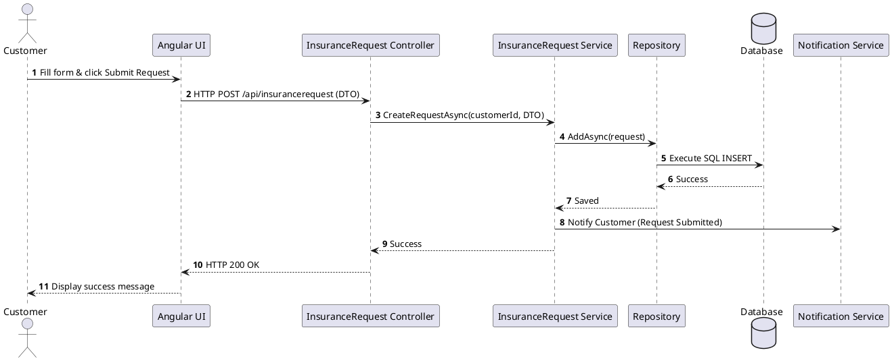
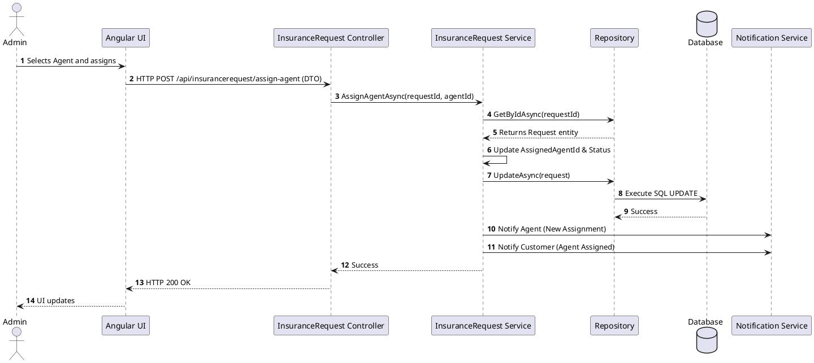
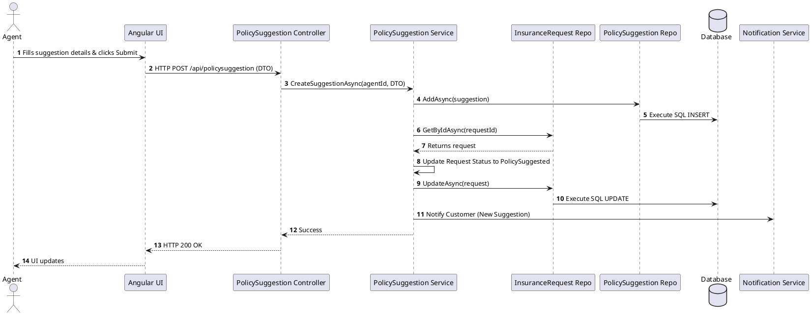
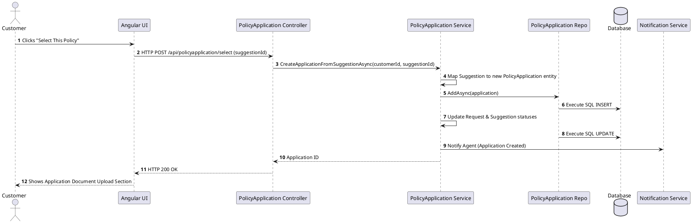
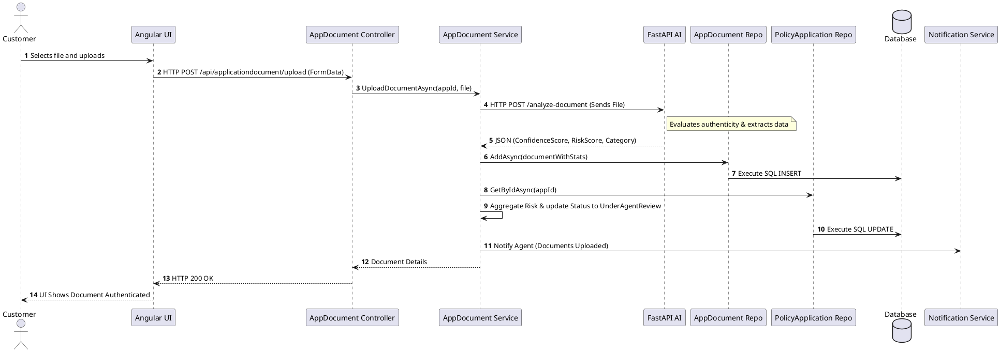
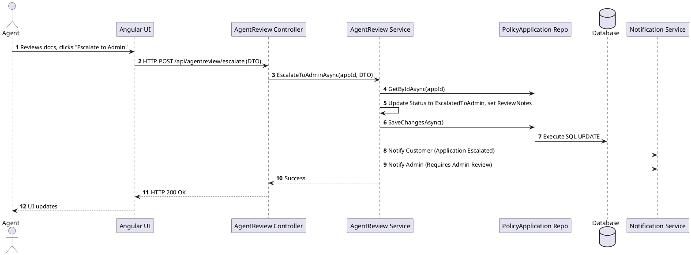
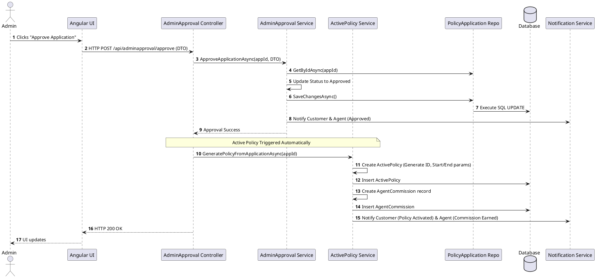
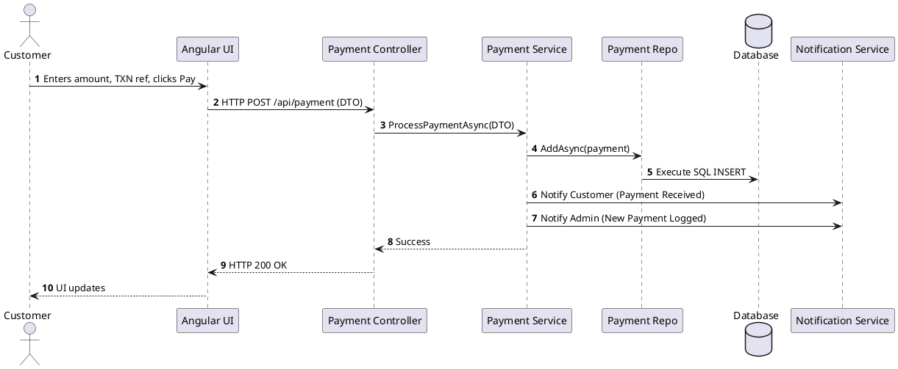
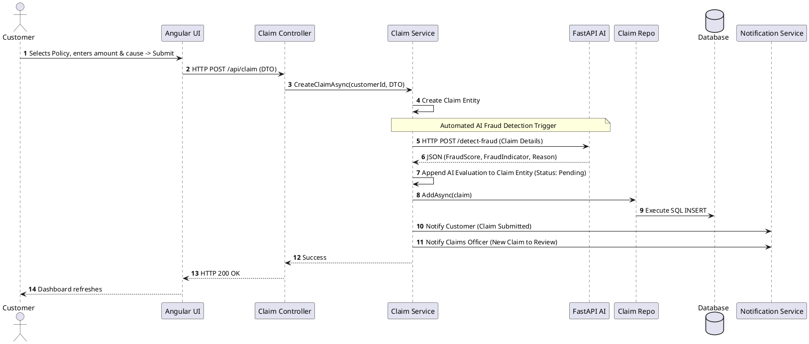
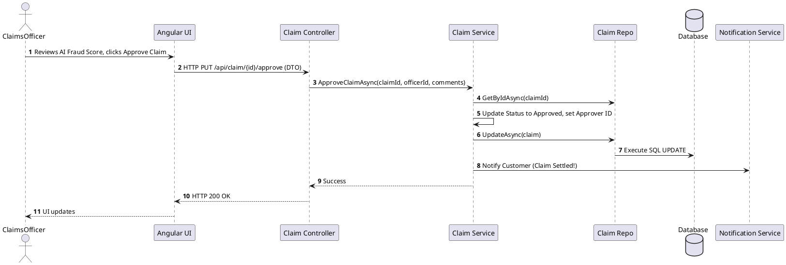

# EventGuard System Workflows (PlantUML)

Here are the detailed PlantUML sequence diagrams for all the key workflows and CRUD operations throughout the system.

## 1. Customer Submits New Request

## 2. Admin Assigns Agent to Request

## 3. Agent Creates Policy Suggestion

## 4. Customer Selects Policy (Creates Application)

## 5. Customer Uploads Document (With AI Microservice)

## 6. Agent Escalates Application to Admin

## 7. Admin Approves Application (Generates Active Policy)

## 8. Customer Makes Payment

## 9. Customer Raises a Claim

## 10. Claims Officer Settles Claim

